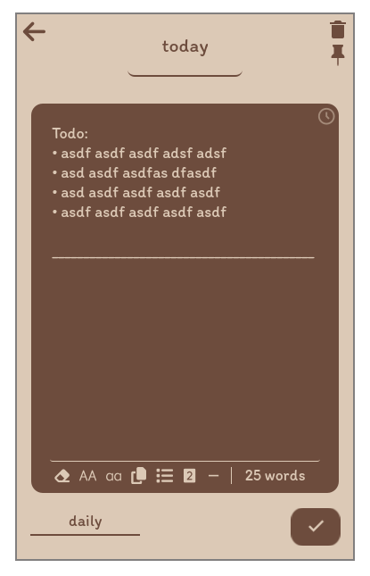

# ProNotes

ProNotes is a simple note-taking application using Tauri (React + Rust), with a focus on ease of use and customization. Manage your notes effortlessly with features like adding, deleting, updating, and pinning. Customize your experience by changing the theme, all while enjoying a sleek and intuitive note editor.

## Features

1. **Add Notes**: Quickly create new notes to capture your thoughts and ideas.

2. **Delete Notes**: Easily remove notes you no longer need.

3. **Update Notes**: Keep your information up-to-date by editing existing notes.

4. **Pin Notes**: Pin important notes to ensure they stay at the top for quick access.

5. **Change Theme**: Personalize your app by making your own theme.

6. **Note Editor**: Enjoy a user-friendly note editor that makes writing and organizing notes a breeze.

### Installation For Linux

Clone the project

cd pronotes

./make

or

bash make
